## Docker Version
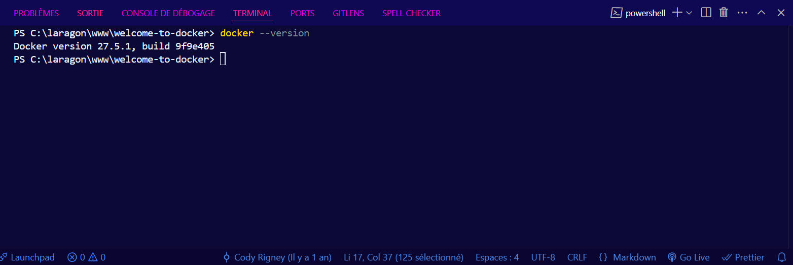
Affiche la version actuelle de Docker installée sur la machine.

---

## Docker Info 1
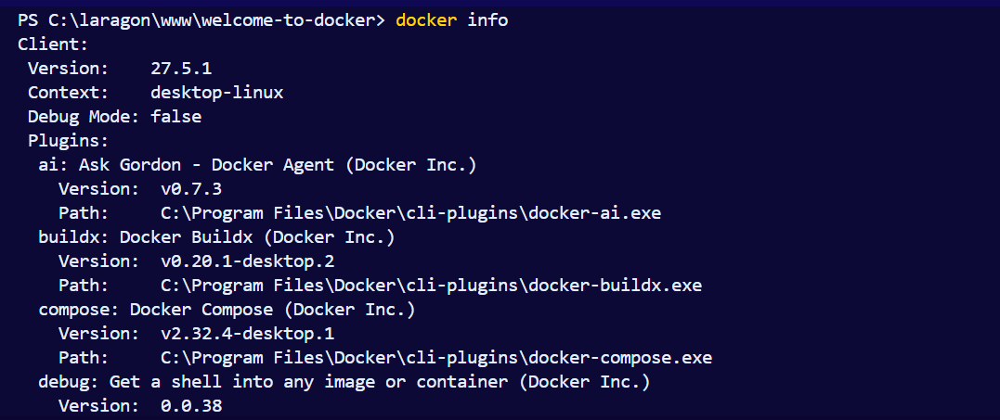
Détails sur l'installation de Docker

---

## Docker Info 2
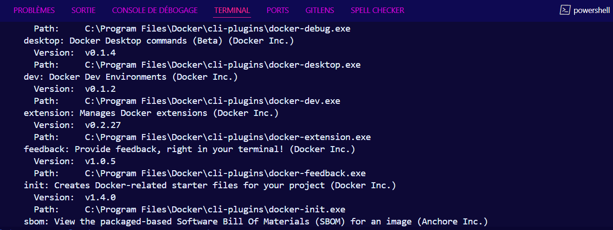

---

## Docker Info 3
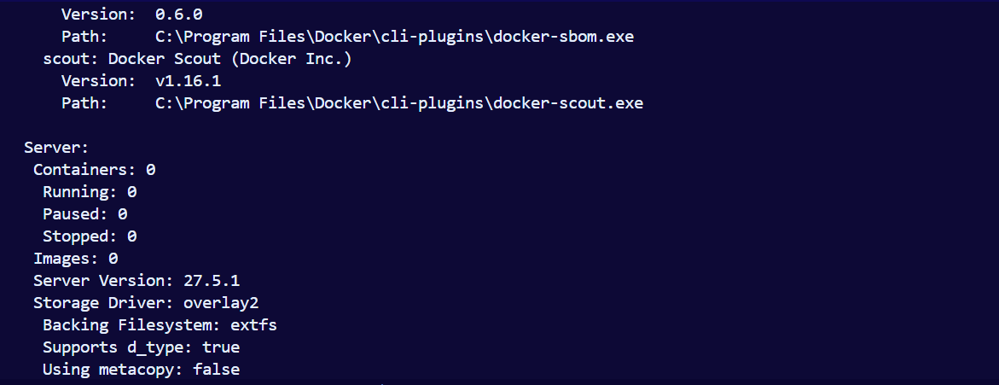

---

## Docker Info 4
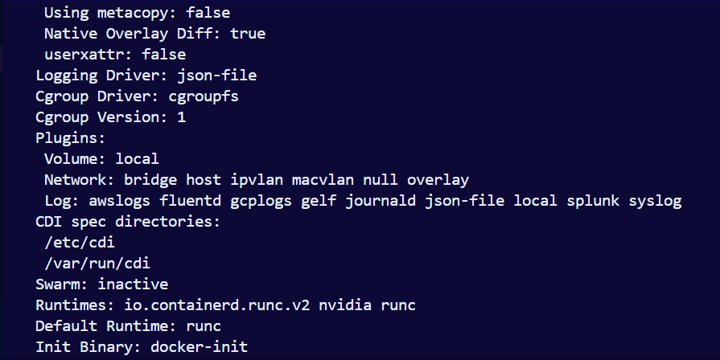

---

## Docker Info 5
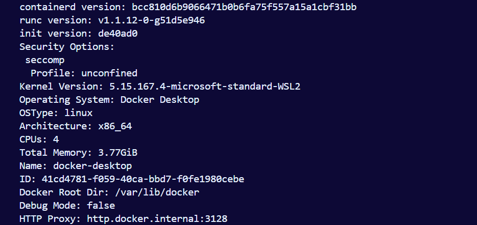

---

## Docker Info 6
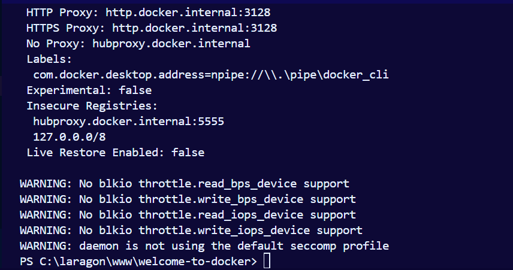
Finalisation des informations détaillées.

---

## Docker Ps
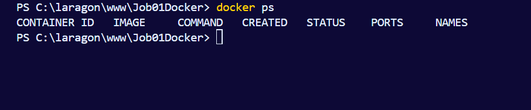
Affiche la liste des conteneurs Docker actifs avec `docker ps`.

---

## Docker Images
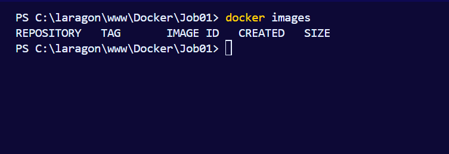
Liste des images disponibles localement avec la commande `docker images`.

---

##  Docker Run
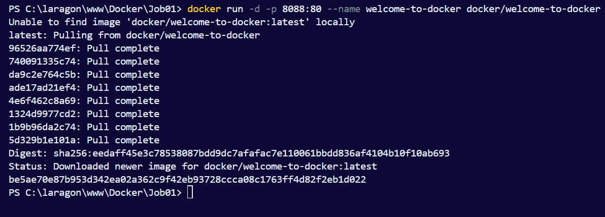
Capture d'écran qui  montre l'utilisation des arguments lors de la commande `docker run`.

---

## Docker Stop
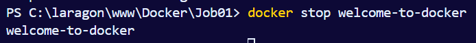
Capture d'écran qui montre l'arret du conteneur welcome-to-docker.

---

## Docker Pull
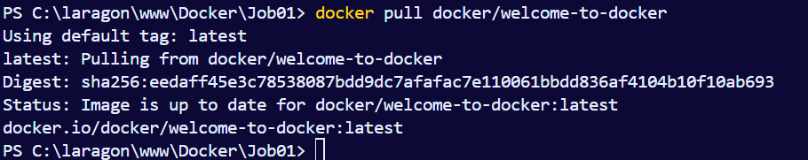
Capture d'écran qui récupère une image du dockerhub.

---

## Docker Img
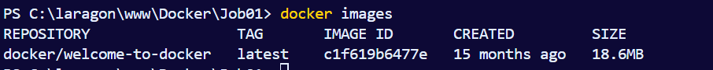
Capture d'écran qui affichent les images avec leur propriétés.

---

## Docker New Container
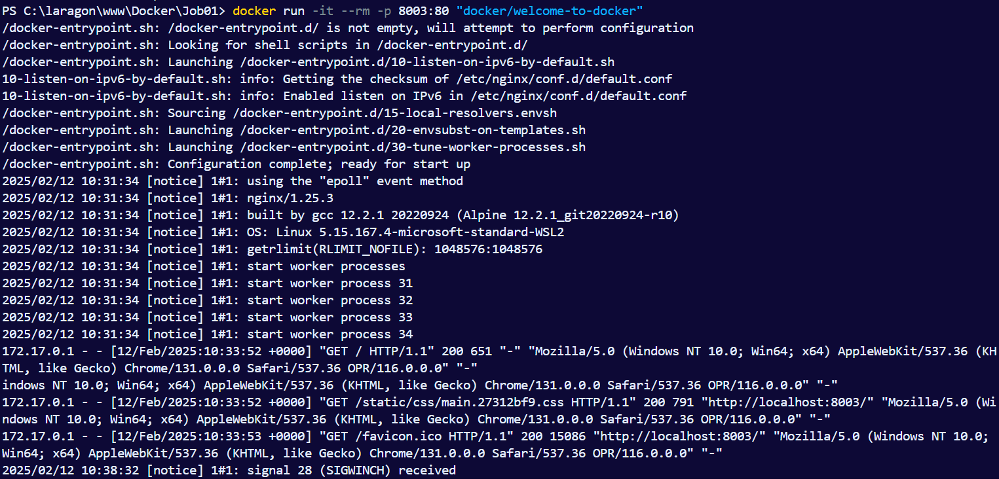
 Construction du nouvaeu container.

---

## supprimer un conteneur spécifique
docker rm <nom_du_conteneur>

## supprimer plusieurs conteneurs
docker rm $(docker ps -a -q)

## supprimer Tous les conteneurs arrêtés
docker container prune

## Forcer la suppression d'un conteneur actif
docker rm -f <nom_du_conteneur>

## supprimer Une image spécifique
docker rmi <nom_de_l_image>

## supprimer plusieurs images
docker rmi <nom_image_1> <nom_image_2> <nom_image_3>

## supprimer toutes les images inutilisées
docker image prune -a

## Forcer la suppression d'une image
docker rmi -f <nom_de_l_image>

## ERREUR
L'erreur est qu'il y a deux fois supprimer toutes les images non utilisés , la correction est images utilisés

